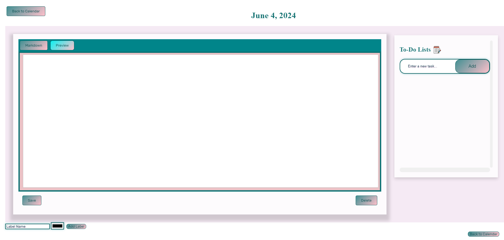

# cse110-sp24-group2 Dev Work Journal

## [Team Wiki](admin/team.md)

In order to help a developer keep track of the work they have done and still need to do, we have developed a work journal that should help alleviate that need in an efficient manner.

The work journal has an easy to navigate calendar that keeps track of some of the major holidays for you, a notes page with full markdown support, a todo list to keep track of your long term goals and projects, and a labelling system that will make searching for your work a breeze!

## Installation

Go to the [Releases page](https://github.com/cse110-sp24-group2/cse110-sp24-group2/releases) in order to find the files that you need to download, whether that is on a Windows, MacOS, or Linux system. Windows should download the .exe file, MacOS the .dmg file, and linux the .zip file.

Then you just have to run the installer (give it permission if it asks for it) and the app should be set up.  

P.S. For the MAC release you might get an error saying that the app is damaged and can't be opened. Don't worry, this only occurs because we haven't paid money to Apple for verification. Open your terminal and type the command
```bash
xattr -d com.apple.quarantine /Applications/Developer\ Journal.app
```  
After that the app should be fully functional to help you achieve your goals!

## Basic Navigation

Upon opening the app, you will find the calendar page that looks like this:


From there you have a fully navigational calendar to log on any day you would like.

You can also see a todo-list page on the side where you can add any goal, mark it as complete, or delete as necessary.

There is also the search bar on the top right where upon clicking it you can choose one of the labels you have created to find all the days with that current label and navigate to them.

Once you click on a day, you will be taken to the notes page that looks like this:



Here you find a page where you can write your notes utilizing [markdown](https://www.markdownguide.org/) format so that when you click on the preview page, you can see your notes in a smooth and easy-to-read way.

The other new feature on this page is the label system at the bottom, simply add a name and select a color of your choice to mark this page so when you look for the topic again later, you can quickly find it once again

---

We hope you enjoy the work journal and can get some good use out of it, thank you!

_- CSE 110 Sp24 King Julian (aka Group 2)_
