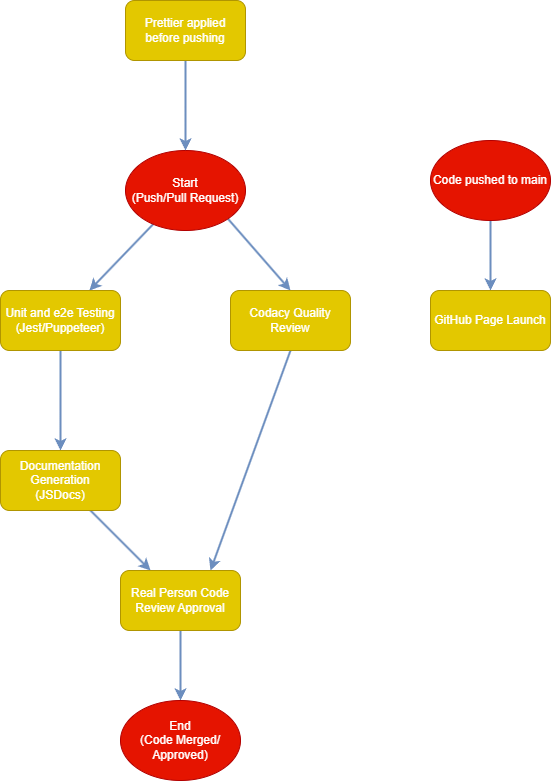

# CI/CD Pipeline Phase 1

## Pipeline graph

## Currently Functional:

### Prettier for Code Linting

We are going to have members apply the `prettier` extension/package to every file that they edit for the project in order to maintain consistent code styling.

### Codacy for Code Quality

We are going to have the Codacy app run quality tests on code to ensure that the code will be maintainable and follows best practices on each pull request.

### Testing:

#### Jest
We will be using Jest in order to implement our unit tests. Examples of Jest unit tests can be found in Lab 5. The `jest` package needs to be installed in order to use Jest properly to run tests.

#### Puppeteer
We will be using puppeteer along with jest in order to complete end-to-end testing. The `puppeteer` and `jest-puppeteer` packages should be installed in order to properly run the e2e testing.

NOTE: We also used the `http-server` package so that GitHub Actions can start up a local server of the code so that puppeteer has a server url to access to perform the tests

### JSDocs for Documentation

We will be using [this Github Actions](https://github.com/marketplace/actions/jsdoc-action) link to implement our JSDocs documentation pipeline process.

The action has been customized to only generate documentation for files in the `/source` folder and output them to the `/docs` folder with the `README.md` file as the front page. This uses the `jsdoc` package

### Pull Request Reviews

For each pull request, after all of the automatic testing and generation is done, a member of the team must review the code and approve it to ensure that the commits do not break the code and that it successfully implements the feature the branch is intended to. After that, the code can be merged into the head branch the pull request references.

### GitHub Pages

The main branch will deploy on GitHub pages so the current published version of main will be accessible for others to use and test

## Future Plans

### Prettier Github Actions & Linting

Currently, we plan for everyone to use `prettier` locally to help code quality. If this strategy does not work, we also have the option to integrate `prettier` into our Github Actions pipeline. We can consult the following two links:
- [Prettier Actions](https://github.com/marketplace/actions/prettier-action)
- [Online Tutorial](https://mskelton.dev/blog/auto-formatting-code-using-prettier-and-github-actions)

Additionally, we can look into adding a layer of linting onto our prettier formatting. The [prettier.io documentation](https://prettier.io/docs/en/comparison.html) mentions that `prettier` should be used for code formatting, while a linter can help prevent and catch potential bugs early. Future options include both looking into using linting locally and integrating it into our Github Actions in a process similar to the one we are using for `prettier`.

### Expanding the pipeline for merging our `Testing` branch into the `Main` branch

We would like to look into further pipeline steps we could implement when merging our testing branch into our main branch. Code merged into our main branch should have the highest standard of quality. There will also be more steps, such as packaging and other finishing touches.