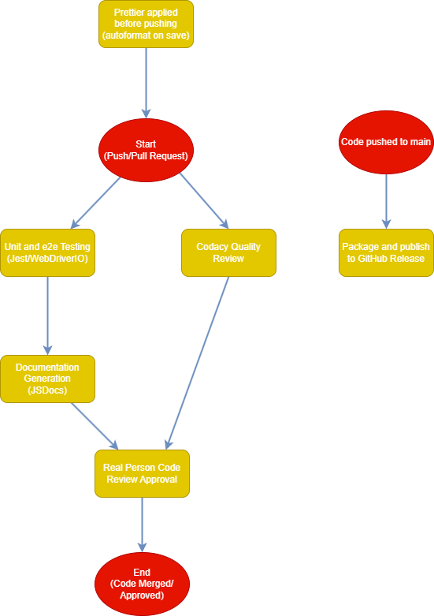

# CI/CD Pipeline Phase 2

## Pipeline graph

## Currently Functional:

### Prettier for Code Linting

We are going to have members apply the `prettier` extension/package to every file that they edit for the project in order to maintain consistent code styling.

Prettier is set up to auto-format any file that is being saved, ensuring that the code practices are uniform for all members

### Codacy for Code Quality

We are going to have the Codacy app run quality tests on code to ensure that the code will be maintainable and follows best practices on each pull request.

### Testing:

#### Jest

We will be using Jest in order to implement our unit tests. The `jest` package needs to be installed in order to use Jest properly to run tests. You can use the `npm run test` command to run the unit tests. The unit tests can be found in the `__tests__/unit` directory.

#### WebDriverIO

We will be using WebDriverIO in order to complete end-to-end testing within the built Electron package. The `wdio` packages should be installed and you must build the app using one of the `npm run package` commands that can be found in `package.json` in order to make this work. Use the `npm run wdio` command in order to run the end-to-end tests. The tests themselves can be found in the `__tests__/e2e` directory.

### JSDocs for Documentation

We will be using [this Github Actions](https://github.com/marketplace/actions/jsdoc-action) link to implement our JSDocs documentation pipeline process.

The action has been customized to only generate documentation for files in the `/source` folder and output them to the `/docs` folder with the `README.md` file as the front page. This uses the `jsdoc` package

### Pull Request Reviews

For each pull request, after all of the automatic testing and generation is done, a member of the team must review the code and approve it to ensure that the commits do not break the code and that it successfully implements the feature the branch is intended to. After that, the code can be merged into the head branch the pull request references.

### Packaging via GitHub Releases

When merging code into the `main` branch, a packaging process begins that builds our app for windows, macos, and linux machines. Those builds are then compressed and uploaded as part of the generated release that can be found on the home page of the repo. This allows users to quickly download the files they need to run the application on their own
