# Sprint 1 Retrospective:

### Time : 
5.30pm on 04/27/2024
### Members present: 
Brian, Dhruv, Uday, Momina, Clarissa, Madhoolika, Andrew, Victor, Dhaivat

### Video of presentation of the project:
[Link to video presenting the project and how it works!](https://www.youtube.com/watch?v=qMnSfuRT7I0&ab_channel=BrianMorse)

### Notes to remember:
- Name your branch with issue name and number you are working on so that we know what branch is addressing what issue and helps keep track of the issues currently being worked on.

## What everyone said they liked about the project:
1. Impressed by the overall look and design of the Calendar.
2. Glad that the visual appearance of the Calendar was appealing.
3. Everything went smoothly and we did not have any clashes/hiccups in the process.
4. Everyone was able to get involved and contribute to the assignment.
5. Peer review of each other's code was done and comments were very helpful in learning.
6. We were able to incorporate different designs for different months.
7. The page responded as we expected it to be and the backend part was functioning very well.
8. Got us more familiar with dividing the workload and working together.

## Step 1:
Anonymously graded the project on each person's Clarity, Engagement, Autonomy, Mastery, Meaning, and Impact.

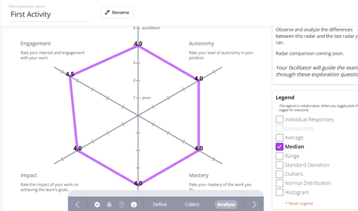
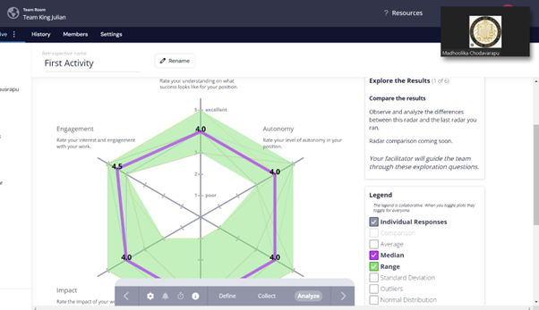

- The result observed was pretty much in the middle of everything. 
- The lowest scores observed were in Mastery and Impact as we have only just started learning about them and haven't had much practice.
- There was also a huge range difference in Mastery which can be attributed to the difference in previous experience.
- Overall everyone felt pretty satisfied

## Step 2:
### Start Stop Continue List

Listed Ideas on what we should Start doing, Stop doing, and continue doing in projects. Then grouped them together if they were similar.

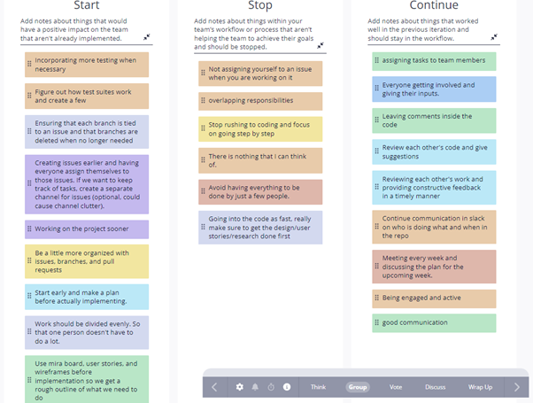
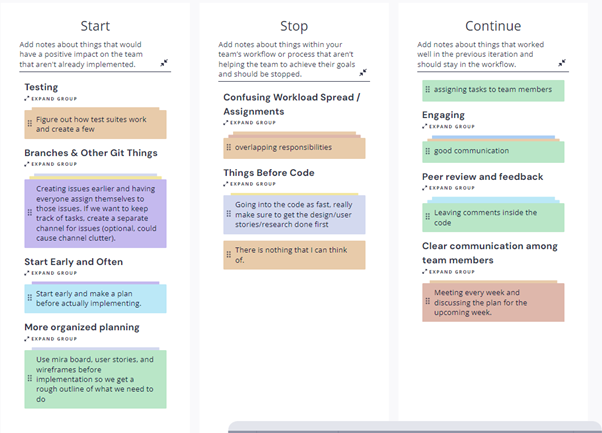

Voting was then done to discuss the topics in the order of highest importance to lowest:

### 1. (Top priority)
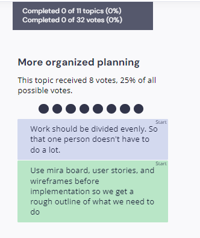

- Make sure we have a plan before we go on to coding and creating the project.
-	Need to get together and brainstorm ideas.
-	Collaborate and be active on the different resources provided for idea sharing.

### 2.
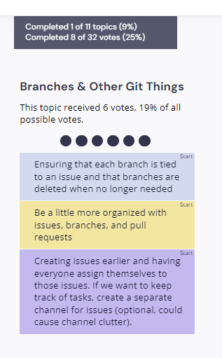
-	Making sure that open branches are closed to avoid clutter.
-	Making sure we add issues early and to keep track of who is doing what and also what is being developed and what still needs to be done.
-	Make sure to use closes keyword in description to help with closing done issues 

### 3. 
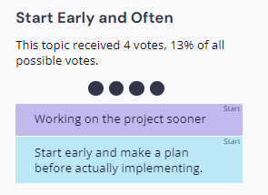
-	Make sure we are on time and not scrambling at the end.
-	Give enough time to each stage of the process.

### 4.
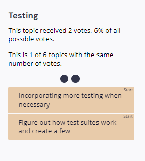
-	Ask TA on how to test code properly
-	Think of tests while brainstorming and during the ideation phase

### 5.
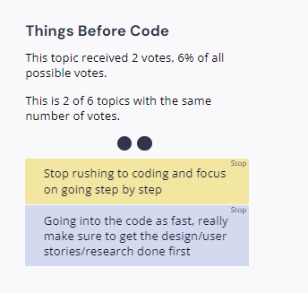

### 6.
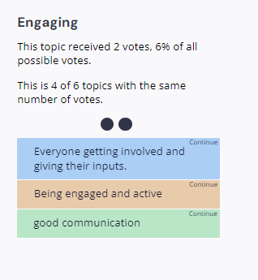
-	Be involved and be active on slack.
-	Convey any problems and concerns you are having.
-	Ask for help if you are stuck.

### 7.
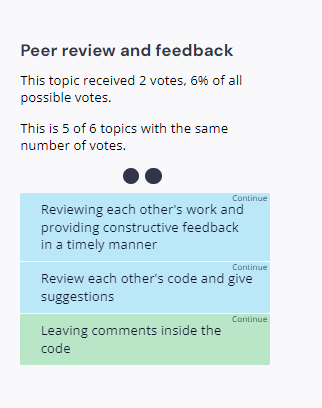
-	Be mindful and open to feedback and have good communication as we are all moving towards the same goal
-	Good documentation and leave links along with comments so it is easier to refer
