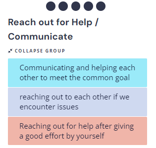

# Sprint 2 Retrospective:

### Time: 
6:10pm on 05/25/2024
### Members present: 
Brian, Dhruv, Uday, Momina, Clarissa, Andrew, Victor, Dhaivat, Anya

## What everyone liked in this sprint:
1. Separation into smaller groups led to improved collaboration.
2. Clear task distribution improved organization during the sprint.
3. Smaller teams contributed to a more organized workflow.
4. Structured discriptive issues made it easier to get involved in tasks.
5. Clear separation of tasks between teams facilitated consistent progress.
6. Stand-up notes were helpful in staying on the same page with others' progress.
7. The clear structure made it easy to identify who to approach for help.
8. GitHub project board helped to further improve the organization of workflow.
9. Collaboration within smaller groups made it more comfortable to reach out for help.
    
## Step 1:
Anonymously graded the project on each person's Clarity, Engagement, Autonomy, Mastery, Meaning, and Impact.

- The result observed was pretty much in the middle of everything. 
- The lowest scores observed were in Mastery as we are only just learning skills required for our task so it is normal to feel lack of mastery in them.
- There was also a huge range difference in Impact which might indicate that some people do not have enought opportunity to work on issues that they find impactful which we should pay attention to in the future.
- Overall everyone felt pretty satisfied

## Step 2:
### Start Stop Continue List

Listed Ideas on what we should Start doing, Stop doing, and continue doing in projects. Then grouped them together if they were similar.

Voting was then done to discuss the topics in the order of highest importance to lowest:

### 1. (Top priority)

- Make sure to create clear documentation for the project
-	Focus on creating tests
-	Work on improving current development pipeline

### 2. (Top priority)

-	Faciliate better communication between teams
-	Create more opportunities for people to contribute on tasks outside of their teams

### 3. 

-	Make sure to reach out for help when having issues for a long time
-	Communicate issues and collaborate with your teams or other group members to resolve them

### 4.

-	Improve the use of GitHub issues and GitHub project board to display progress in organized manner
-	Consider adding priority labels for issues to better understand the urgency of tasks at hand

### 5.

