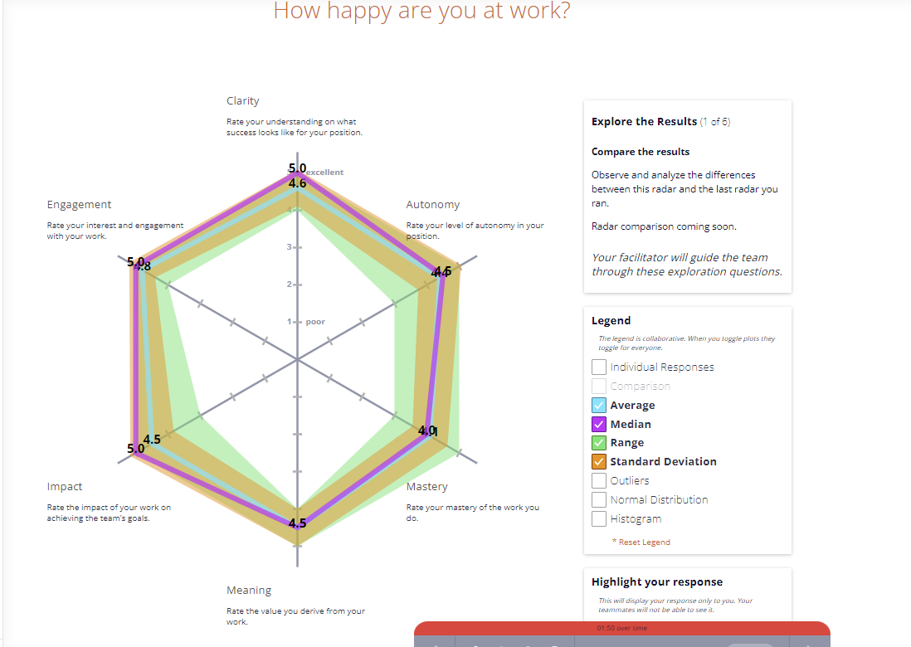
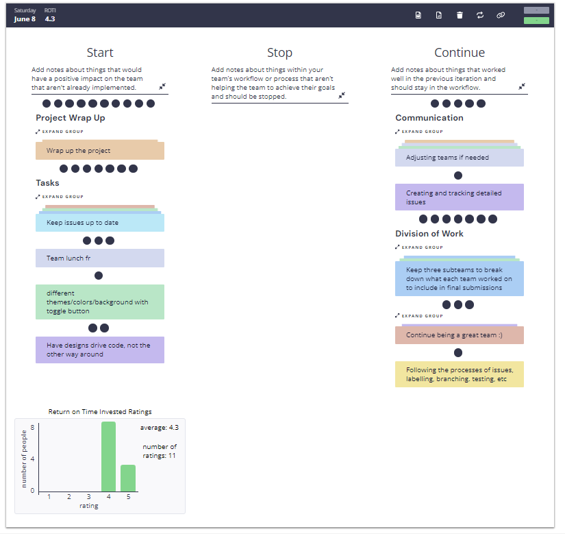
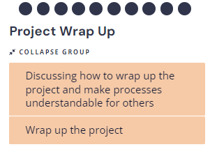
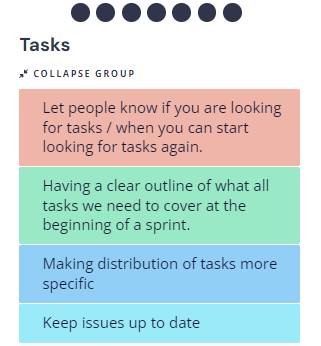
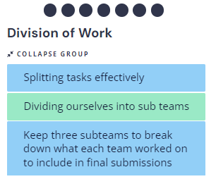
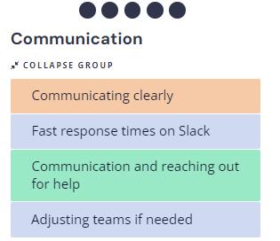

# Sprint 2 Retrospective (2nd week):

### Time: 
5:30pm on 06/08/2024
### Members present: 
Everyone

## What went well in this sprint:
1. The feedback on the sprint was overall very positive.
2. Satisfied with the final product's appearance (special thank you to Momina!).
3. Further frontend enhancements (e.g. animations, logo, bug fixes)
4. Significant team effort and energy invested.
5. Worked a lot on cleaning code and creating documentation.
6. Completion of unit and end-to-end tests to cover all functionalities of the app.
7. Strong teamwork and involvement from all team members.
8. Impressed with the teamwork and final outcomes.
    
## Step 1:
Anonymously graded the project on each person's Clarity, Engagement, Autonomy, Mastery, Meaning, and Impact.

The result observed showed significant improvements compared to the last retrospective with the mean being between 4 and 5 for every category. This increase in satisfaction shows that splitting into teams, creating detailed issues and other team strategies we have implemented over the course of the quarter payed of, making the work more enjoyable and effective.

## Step 2:
### Start Stop Continue List

Listed Ideas on what we should Start doing, Stop doing, and continue doing in projects. Then grouped them together if they were similar.

Voting was then done to discuss the topics in the order of highest importance to lowest:

### 1. (Top priority)

-   Discuss any pending TODOs left for the project
-   Wrap up any work on code before Sunday night
-   Clean the repository from unnecessary elements and update documentation

### 2.

-	Strategies of improving teamwork if we were to continue our project
-	Recognized the importance of communication and organizing tasks well 

### 3. 

-	Recognized effective teamwork strategies this sprint 

### 4.

-	Highlighted the importance of clear and fast communication

### 5.

