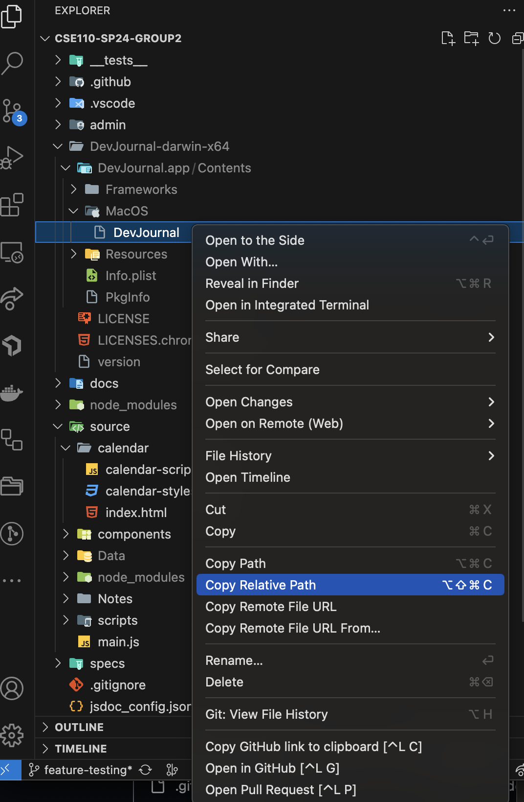

# cse110-sp24-group2

## [Team Wiki](../team.md)

## Running the App

1. Make sure that the root package.json looks like this:

```json
{
  "name": "dev_journal",
  "version": "1.0.0",
  "description": "A Developer Journal That tracks what you do in a day",
  "main": "source/main.js",
  "devDependencies": {
    "@wdio/cli": "^8.38.1",
    "@wdio/local-runner": "^8.38.0",
    "@wdio/mocha-framework": "^8.38.0",
    "@wdio/spec-reporter": "^8.38.0",
    "electron": "^30.0.9",
    "electron-packager": "^17.1.2",
    "jest": "^29.7.0",
    "jsdoc": "^4.0.3",
    "prettier": "3.2.5",
    "wdio-electron-service": "^6.6.1"
  },
  "scripts": {
    "test": "node node_modules/jest/bin/jest.js",
    "start": "electron .",
    "package-win": "electron-packager . DevJournal --platform=win32 --arch=x64 --asar",
    "package-mac": "electron-packager . DevJournal --platform=darwin --arch=x64 --asar",
    "package-linux": "electron-packager . DevJournal --platform=linux --arch=x64 --asar",
    "wdio": "wdio run ./wdio.conf.js"
  },
  "jest": {
    "transform": {},
    "verbose": true
  }
}
```

2. Install the necessary dependencies:

```bash
npm install
```

3. Depending on which device you have, run one of the following commands:

```bash
npm run package-win
npm run package-mac
npm run package-linux
```

4. Run the app:

```bash
npm start
```

### Running the End to End Tests

The testing should be automatic when you make a PR, but for when you do the testing on your machine, please ensure you have done the following steps:

1. Make sure you have run `npm install` to get all of the dependencies required
2. Make sure you build the app, look at the README for further instructions
3. If you are on Windows, ignore this next step:
   1. Otherwise, you need to change the BinaryPath in wdio.conf.js line 58 to the binary path generated by your build 1. If you are on Mac, right click this generated file from the build and click "copy relative path". That will be your path to binary (edited)
      
   2. DO NOT PUSH CHANGE TO CONFIG FILE
4. Run `npm run wdio` to run the e2e tests
5. if you want to only run the todo list e2e tests, edit the "wdio" script in package.json to be `wdio run ./wdio.conf.js --spec ./__tests__/e2e/todo.test.js`.

## Linting

### TLDR:

- `npx prettier . --w` to run the linter and overwrite files (for formatting)
- `npx prettier . --check` to run the linter but not overwrite files

Make sure `npx prettier . --check` does not show any unformatted files before pushing.

### If you use other linters in other projects...

- Go to the extensions tab and click "disable in workspace" for all non-prettier extensions
- `CTRL-SHIFT-P` and type "Preferences: Open Workspace Settings (JSON)". Click it, it should make / take you to `settings.json`
- Paste the following inside:

```
{
  "editor.defaultFormatter": "esbenp.prettier-vscode",
  "[javascript]": {
    "editor.defaultFormatter": "esbenp.prettier-vscode"
  }
}
```

### Documentation:

[Prettier Docs](https://prettier.io/docs/en/cli.html)

### Finding Stored Files on The Release Version (Mac)

- `npm run package` creates a build. The following JSON in `package.json` is also relevant for this npm script, but please google the `electron-builder` pacakge to understand the keywords.

```json
"build": {
    "appId": "com.cse110.devjournal",
    "directories": {
      "output": "DevJournal"
    },
    "files": [
      "source/**/*"
    ],
    "asar": false
  },
```

- Once you create the build / run the command, it should generate a folder called `DevJournal`. Right click `DevJournal` and Reveal its Location in the Finder.
- Right click the application, then click "Show Package Contents
- Navigate to `cse110-sp24-group2/DevJournal/mac-arm64/Developer Journal.app/Contents/Resources/app/DevJournal/Data` to find app local data

### Archive:

- `npx eslint` to check files that violate eslint (code quality / potential bugs)
  - Need to run `npx eslint` inside the source directory. Use `cd source` if necesasry
