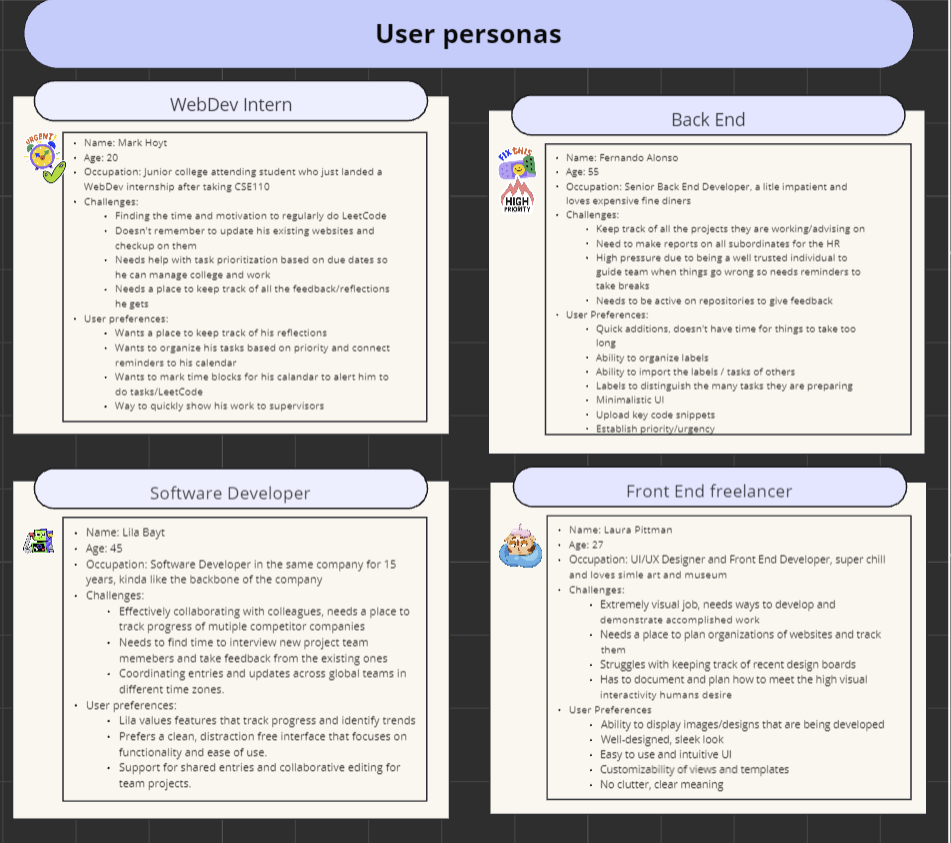
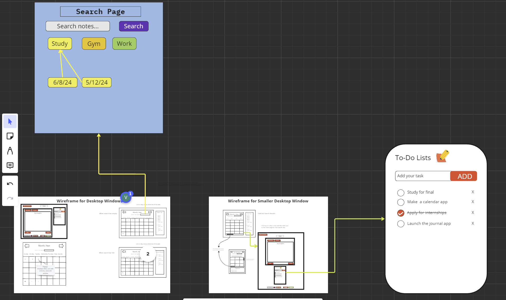
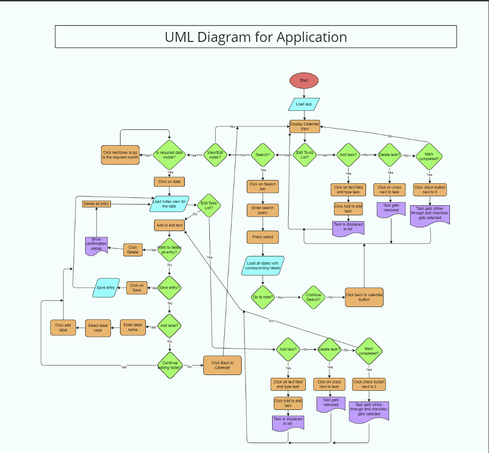
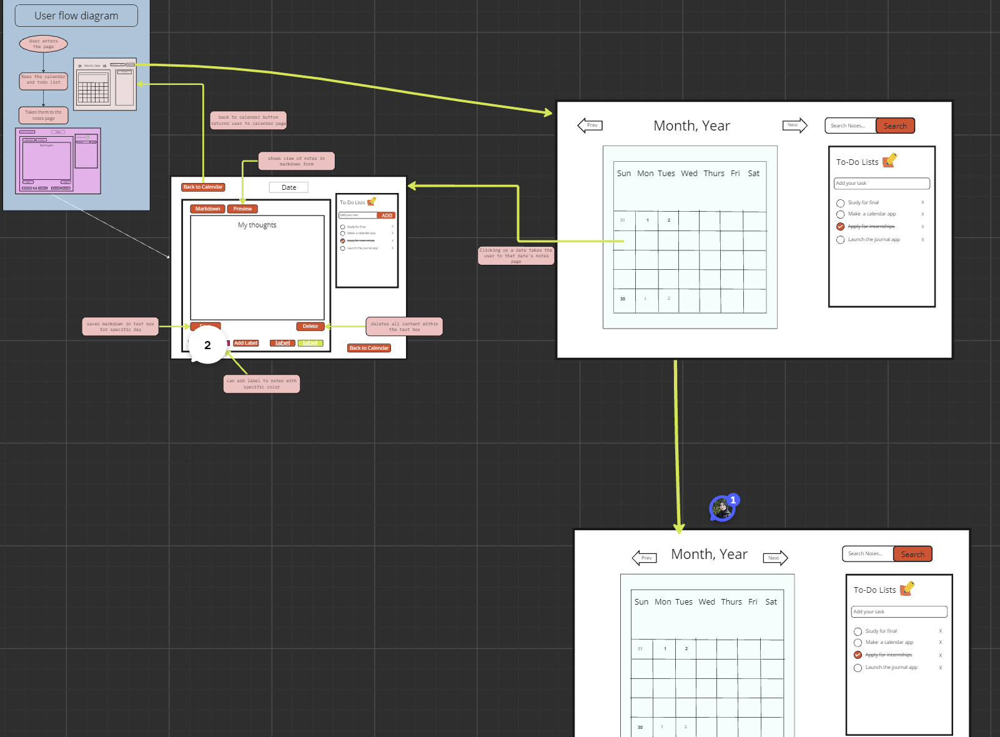

# Reflection on Processes + Concepts

Throughout our project, we applied various SWE concepts and processes that we learned in class. We also reflected on what we can improve on in the future in terms of this project, because we know that

## Our Use of Processes

We used different processes throughout our project. One process we emphasized on the most is the Tuckman model

**Our use of the Tuckman model**

1. Forming

- Team video
- First team bonding meeting
- Warmup assignment

2. Storming

- Design process and Miro Board Usage:
  - The Miro board was instrumental in mapping out user stories, workflows, and user journeys. This visual representation helped the team identify potential bottlenecks and areas for improvement.
  - The team used the Miro board extensively for brainstorming and collaboration. They took the user stories into consideration and listed ideas and features that those users might want.

- Wireframes:
  - The team created wireframes to outline the initial design of the user interface. These wireframes provided a visual guide for the Performing phase and helped in aligning the design with user expectations.
  - We created a lot of different designs and also had a place for discarded designs to show the various design approaches we took.

- Architecture Decision Record (ADR) Construction:
  - All the ideas and designs were presented in meetings and decisions were made by voting and all inputs were considered. This helped building our ADR file as we made crucial decisions for how our app should look like and behave.
  - The team built an ADR to document important architectural decisions. This included justifications for choosing certain technologies, design patterns, and frameworks.
  - The ADR process helped in building consensus among team members by providing a structured way to discuss and document decisions.
- UML Diagrams:
  - UML diagrams were used to represent the system architecture.

- When some members of team started to feel lost due to unequal distribution of work
- Meetings taking too long, people needing to drop b/c meetings went over time

3. Norming

- Adjusting team structure and forming the three subteams
- Creating the 3 subteams to clarify roles and distribute work equally
- Retrospectives and sprint reflection using Retrium
  - Started using timers to keep meetings on pace and make meetings shorter
  - Sprint Retrospective Week 8: Keeping each other accountable, more strict reviews.
  - One example of an issue where we had more strict reviews and kept each other accountable is: [https://github.com/cse110-sp24-group2/cse110-sp24-group2/pull/118/files] (IE comments on issues requesting changes for JSDocs)
    
- Having our Miro board drive our code / be up to date with our code
- Adding priority labels to our issues so we can prioritize tasks
  - https://github.com/cse110-sp24-group2/cse110-sp24-group2/blob/feature-testing/admin/meetings/042724-retrospective.md
    

4. Performing

   - Establishing subteams and policy channel
   - Move more towards solo and pair programming

**How different processes ties into one another**

1. Graceful degradation

Our project uses graceful degradation because we use the latest versions of our libraries to account for developers keeping systems up to date

This accounts for compatibility based on -ilities in the -ilities document

One issue that proves this is:

https://github.com/cse110-sp24-group2/cse110-sp24-group2/issues/65

2. Utilizing various types of programming (solo, pair, mob)

For **weeks 6 and 7** we utilized lot of mob programming

This is classified as part of our storming stage (from the Tuckman model) because each of us were still exploring what each of our individual roles were, what works best for each of us and make sure we can foster a team environment where everyone felt they played a major role in building our project

For **week 8** after our retrospective meeting we switched to doing more pair programming and having two people work on issues together

In this example, we had:

**Uday:** second issue coder, first Issue reviewer
**Madhoolika:** First Issue coder, second Issue reviewer

This is classified as part of our norming stage because we found that splitting our overall team into three subteams allowed us to find our roles within the team and be on the same page with one another

We created a structure that would allow us to produce high quality code and keep each other accountable in terms of what we expect from the issues and sticking to our processes

Once assigned to different subteams, we each developed the skills required for our roles and did a lot of pair programming within our subteams

For **weeks 9 and 10**, we used a mix of solo and pair programming.

This is classified as part of our performing stage because everyone found a role and work style that they were most comfortable with, and
we all worked together and helped each other out with our respective subteam's assigned issues

Down below are three examples of issues that show our mix of solo and pair programming within the team:

[https://github.com/cse110-sp24-group2/cse110-sp24-group2/pull/119](Figuring out merge conflicts using pair programming (screen share))

[https://github.com/cse110-sp24-group2/cse110-sp24-group2/issues/48](Implementing autofill/label dropdown feature by coder-reviewer basis)

[https://github.com/cse110-sp24-group2/cse110-sp24-group2/issues/59](implementing searchbar feature by coder-reviewer basis)

3. Refactoring + Accountability on Processes

Throughout development, we also made sure to refactor the code we wrote so that we can keep our codebase clean

This accounts for **maintainability** because we want to make sure our codebase is clean and organized in case we have to make any changes in the future

The two issues below is one where we refactored the code to follow the DRY concept (Don't Repeat Yourself)

[[REFACTOR] Calendar Colors Not Following DRY · Issue #74 · cse110-sp24-group2/cse110-sp24-group2](https://github.com/cse110-sp24-group2/cse110-sp24-group2/issues/74)

[[REFACTOR] Test cases to use vars.js as Single Source of Truth (DRY) · Issue #198 ·](https://github.com/cse110-sp24-group2/cse110-sp24-group2/pull/198)

## Improvements For the Future

Even though our team did a good job with following the processes for our project, there are still some things we can do to make our project better

- emphasize more on the maintainability and portability sections
- consider more about what prof said about left to right view of app
- more flushed out Miro board designs before development
