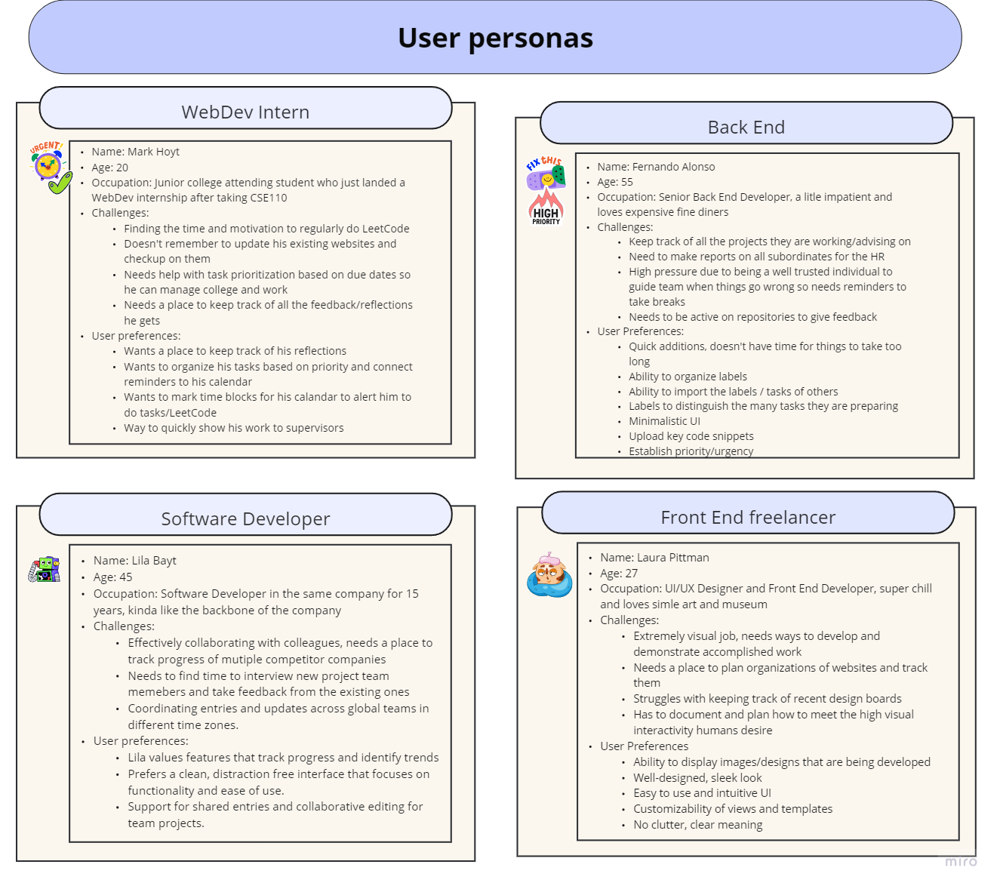
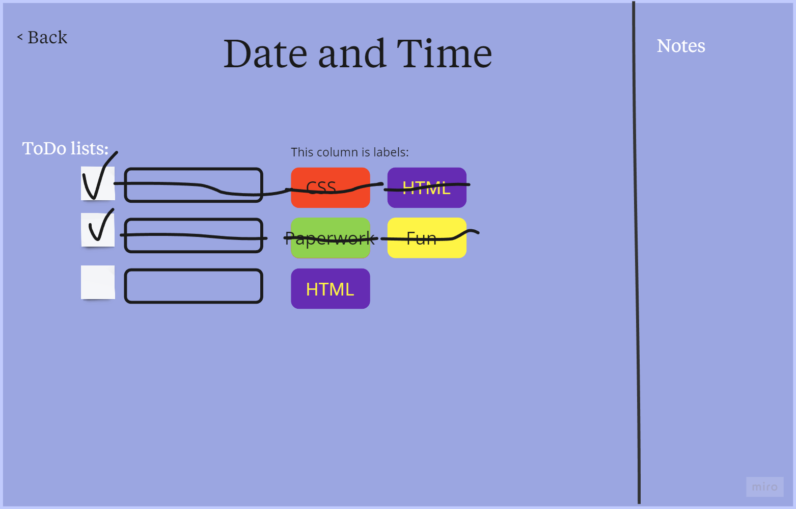
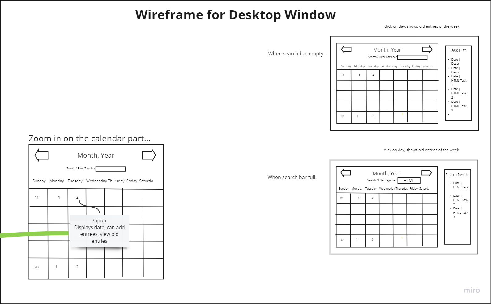
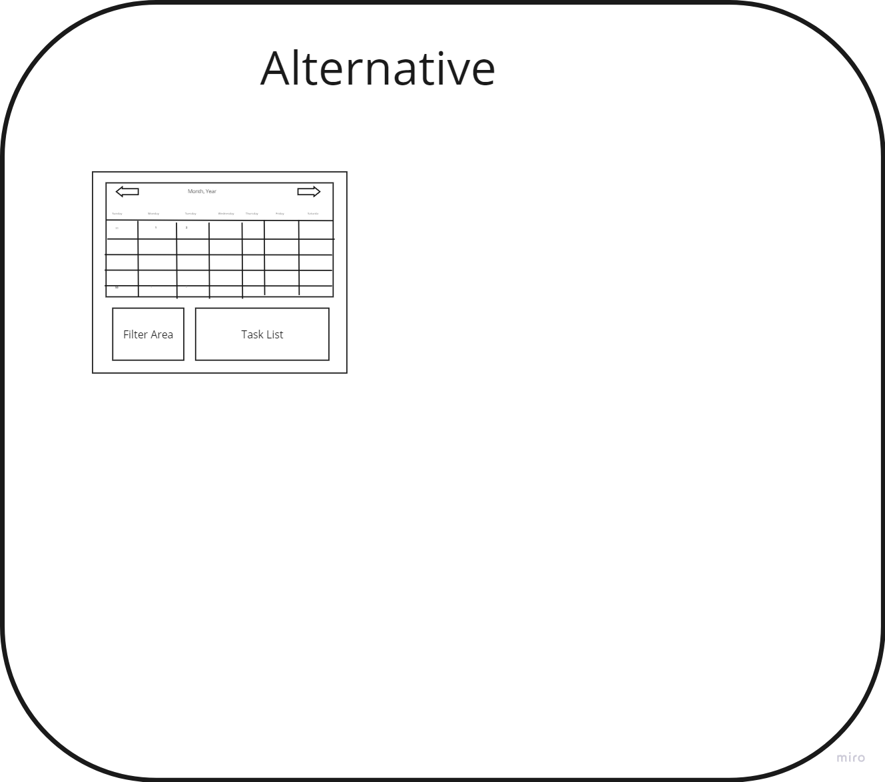
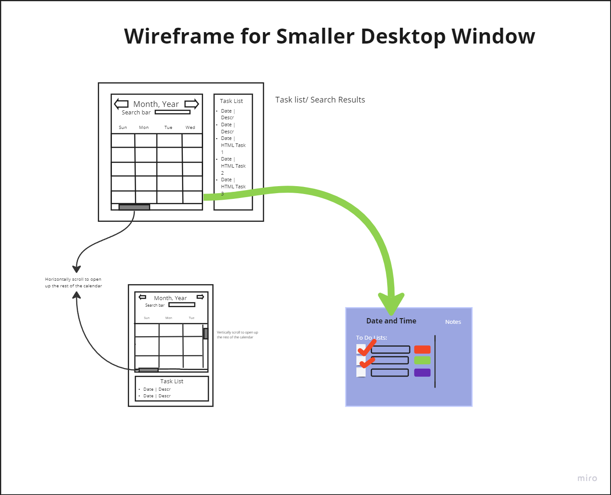

# King Julian Project Pitch (Group 2)

## Problem

Developers spend a lot of time in meetings, sketching up designs, and writing code, but a lot of this work needs to be remembered by the time a yearly review or promotion prospect is on the table, but there is often no documentation. They also tend to have a lot of clutter of different activities to keep track of that can be difficult to juggle without something to help make things more clear. Due to this, it is clear that there needs to be some product that can help keep track of all of this work as well as keep it clean and understandable to be read and acknowledged later on.

In order to truly understand what the solution may require, we looked at some of the needs and use cases for a mix of different developers: a webdev intern, front end designer, back end developer, and a generalized software engineer. 

After looking at the four core personas, we found that some of the main issues that would need to be addressed are a key tracking system for different projects and urgency levels as well as a need for a quick, intuitive UI so that ideas and reflections can be quickly written and have the developers go on to work on their other tasks. Our solution aims to take on that task.

## Appetite

Given that the team involved in making this app will only be together for about five more weeks, it is crucial to narrow down exactly what we are looking to accomplish in this time. 

When looking at the users that would be using the app, it is found that we want to focus on an individual user experience that would exist on their laptop as there simply is not enough time to create a complex process that would allow interactivity and easily support the use of multiple devices. The team found this acceptable since the purpose is to keep track of one’s own work, not others, and most users would only have the code and other snippets they would want to upload on the laptop they are working on.

We also acknowledge that while having a way to have a lot of customizability and a community-sourced template page would be nice, there are not enough resources to support that. There will of course be some level of custom items that users can add to cater to their work style, but a simple sleek design seemed to be appropriate for a starting point for this app.

## Solution

Our solution is a comprehensive, user-friendly, and intuitive Dev Work Journal application designed specifically for developers. This offline desktop app will serve as a one-stop solution for developers to keep track of their work throughout the year, providing a robust platform to aggregate their work for promotions/pay raises.
 
The core functionality of our Dev Work Journal app revolves around the management of primary tasks. Developers will be able to create individual entries for each task they work on, whether it’s a bug fix, a new feature, or a code review. Each entry will include details such as the task description, start and end time, and any relevant notes or comments. This feature is designed to provide a comprehensive and detailed record of a developer’s contributions over time. It’s not just about tracking hours; it’s about documenting the value they bring to the team and the project. This could include problem-solving skills, creativity in finding solutions, and the ability to work under pressure or tight deadlines. Moreover, the primary tasks feature will support different categories of work, such as coding, debugging, testing, documentation, and more. This way, developers can showcase their versatility and breadth of skills.

Our app will provide full CRUD (Create, Read, Update, Delete) functionality. This means developers can easily add new entries, view and update existing entries, and delete entries if needed. This flexibility allows developers to maintain an accurate and up-to-date record of their work.

Developers can use labels to categorize and prioritize their tasks. For example, labels can be used to indicate the urgency of tasks or to separate tasks into different categories (e.g., bug fixes, feature development, code reviews). This feature helps developers to organize their work more effectively.

The app will include a built-in calendar to help developers visualize their work timeline. They can see at a glance when they work on specific tasks, making it easier to track their productivity and progress over time.

Checkboxes will be used to mark tasks as completed. This provides a satisfying way for developers to track their progress and see at a glance which tasks are still outstanding. The task tracker provides a real-time overview of all tasks. Developers can see what they’re currently working on, what’s up next, and what’s been completed. This helps with planning and time management.

If time allows, we’ll also add these features; Developers will be able to write their entries in markdown, a popular formatting syntax for text. They can then export their journal or selected entries as a PDF, making it easy to share their work record with others. They will be able to copy and paste code snippets directly into their journal entries. This is useful for documenting specific solutions or techniques. Developers will be able to add images to their entries. This could be useful for including screenshots of their work, such as a UI they’ve designed or a data visualization they’ve created.

These features are designed to make the Dev Work Journal a powerful tool for developers, helping them to document their work, track their progress, and ultimately advocate for their value within their team or company.

Here is a basic view of how the app should work in different states:

## Risks and Rabbit Holes

In the development of our Dev Work Journal app, we’ve identified several potential risks and rabbit holes that could impact our project timeline and deliverables:

One of the challenges we anticipate is the implementation of the markdown feature and the fancy saving feature. Not all developers are familiar with markdown, and the fancy saving feature might be complex to implement. If we encounter difficulties, our fallback plan is to allow users to input basic text and save their entries as simple text files.

While our goal is to allow users to save images and other files in their journal entries, this could prove to be technically challenging. If necessary, we’ll fall back to saving basic text instead of images and other files.

We plan to use ElectronJS for developing our desktop app, but we’re aware that ElectronJS can sometimes fail and exhibit strange behaviors. To mitigate this risk, we’re prepared to explore other tools such as Meteor, Nativefier, and WebUI.

Our app is designed to be used on a single device, but we understand that users may want to transfer their data from one device to another. This could be a complex feature to implement. If we run into issues, our fallback plan is to allow users to zip their journal file and manually transfer it to another device.

By identifying these potential risks and rabbit holes upfront, we’re better prepared to handle any challenges that come our way during the development process. We’re committed to delivering a high-quality product, and we’ll do our best to navigate these challenges effectively. 

## Out of Scope

While we aim to provide a comprehensive and user-friendly solution with our Dev Work Journal app, it’s important to clarify what our current version will not include. This helps set realistic expectations and allows us to focus on delivering a high-quality product within our defined scope. Here are the features that are currently out of scope:

Our initial release is designed as an offline desktop app. This means that it won’t have online syncing or cloud storage capabilities at this stage. We understand the convenience of online access, but our current focus is on creating a robust and reliable offline experience.

At this time, our app is being developed for desktop platforms only. We recognize the growing trend of mobile computing, but mobile support requires a different set of design and development considerations. Therefore, a mobile version of the Dev Work Journal app is not included in our current development plan.

Our app is designed to be used by individual developers on their personal computers, so it won’t include a login system or user accounts. We prioritize simplicity and ease of use, and we believe that a login system is not necessary for our current scope.

By clearly defining what’s out of scope, we can ensure that we’re focusing on the features that will provide the most value to our users in the initial release. As we gather feedback and learn more about our users’ needs, we can consider expanding our scope in future updates. 

